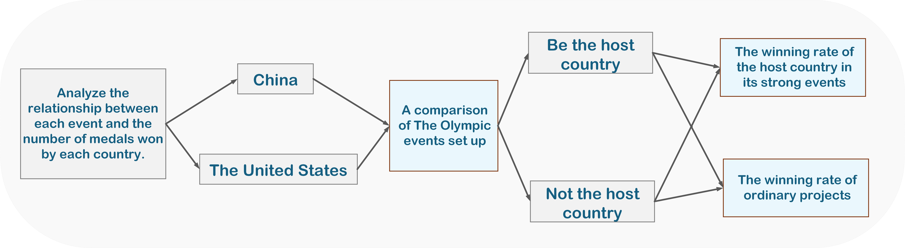
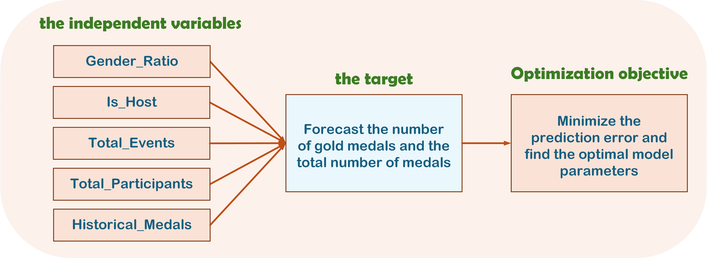

# 🏅 Olympic Medal Prediction: 2028 Los Angeles Games

[](README.md)
[](README_zh-CN.md)


A comprehensive machine learning system utilizing **Gradient Boosting Regression Trees (GBRT)** to analyze historical Olympic data and predict medal counts for the **2028 Los Angeles Summer Olympics**.

> Based on the research paper: *Prediction and Analysis Based on the GBRT Model*.

---

## 📊 Key Visualizations

> 💡 *Note: These plots are generated by running the visualization scripts in `src/visualization/`.*

### 2028 Medal Predictions (Total)
*Forecasted total medal counts for top performing nations, including confidence intervals.*


### Feature Importance Analysis
*Analysis of factors contributing to Gold vs. Total medal counts.*


## 📑 Research Insights

Derived from the core GBRT analysis in our [Research Paper](docs/Prediction_and_Analysis_Based_on_the_GBRT_Model.pdf).

### 1. GBRT Model Framework
*A systematic approach to multi-feature regression for Olympic medal forecasting.*


### 2. 2028 Medal Prediction World Map
*Global heatmap showing predicted gold medal distribution for the 2028 Olympics.*


### 3. Winning Rate Correlation Heatmap
*Heatmap showing the winning rates of top 10 countries across different events.*


### 4. Model Residuals Analysis
*Residual plots validating the GBRT model's prediction accuracy for gold and total medals.*


---

## 🚀 Key Features

*   **Advanced Data Cleaning**: Robust pipelines to handle multi-source data (Athletes, Medals, Hosts, Programs).
*   **Feature Engineering**: Extraction of critical signals including Host Country Effect and Historical Momentum.
*   **GBRT Modeling**: Optimized Gradient Boosting Regressor with Grid Search hyperparameter tuning.

---

## 📂 Project Structure

```bash
Predicting-Medals/
├── data/
│   ├── raw/                 # Original datasets (from Kaggle/Olympic.org)
│   └── processed/           # Cleaned and merged CSVs
├── docs/                    # Research papers and documentation
├── outputs/                 # Generated plots and prediction results
├── result/                  # Static visualization assets from research paper
├── src/
│   ├── analysis/            # Statistical analysis scripts (Coach effect, etc.)
│   ├── data_cleaning/       # Preprocessing pipelines
│   ├── feature_engineering/ # Feature construction
│   ├── models/              # GBRT and Linear Regression models
│   └── visualization/       # Plotting scripts
├── requirements.txt         # Project dependencies
├── .gitignore               # Git exclusion rules
├── LICENSE                  # MIT License
└── README.md
```

---

## 🛠️ Installation

1.  **Clone the repository**
    ```bash
    git clone https://github.com/1EchA/Predicting-medals.git
    cd Predicting-medals
    ```

2.  **Install dependencies**
    ```bash
    pip install -r requirements.txt
    ```

3.  **Prepare Data**
    Unzip the raw data into the `data/raw` directory:
    ```bash
    unzip data/Data.zip -d data/raw/
    ```

---

## 💻 Usage

To reproduce the analysis and predictions, follow this pipeline:

### 1. Data Cleaning
Standardize names, handle missing values, and merge datasets.
```bash
python src/data_cleaning/clean_athletes.py
python src/data_cleaning/clean_medals.py
python src/data_cleaning/clean_hosts.py
python src/data_cleaning/clean_programs.py
```

### 2. Feature Engineering
Construct the training dataset with historical features.
```bash
python src/feature_engineering/build_dataset.py
python src/feature_engineering/merge_events.py
```

### 3. Model Training & Prediction
Train the GBRT model and generate predictions for 2028.
```bash
python src/models/gbrt_model.py
```

### 4. Visualization
Generate the plots shown above.
```bash
python src/visualization/gbrt_visualization.py
python src/visualization/feature_visualization.py
```

---

## 📈 Model Performance

The GBRT model was tuned using Grid Search with 5-fold cross-validation.

| Metric | Value |
| :--- | :--- |
| **Model** | Gradient Boosting Regressor |
| **CV MSE** | ~Optimized |
| **Key Hyperparams** | `n_estimators`: [100, 200], `learning_rate`: [0.05, 0.1] |

**Key Findings:**
*   **Host Effect**: Significant boost in medal counts for host nations.
*   **Historical Momentum**: Previous games' performance is the strongest predictor.
*   **Gender Parity**: Balanced gender ratios correlate with higher overall medal counts in modern games.

---

## 👥 Authors

*   **1EchA** - *Lead Developer & Researcher*

## 📄 License

This project is licensed under the MIT License - see the [LICENSE](LICENSE) file for details.