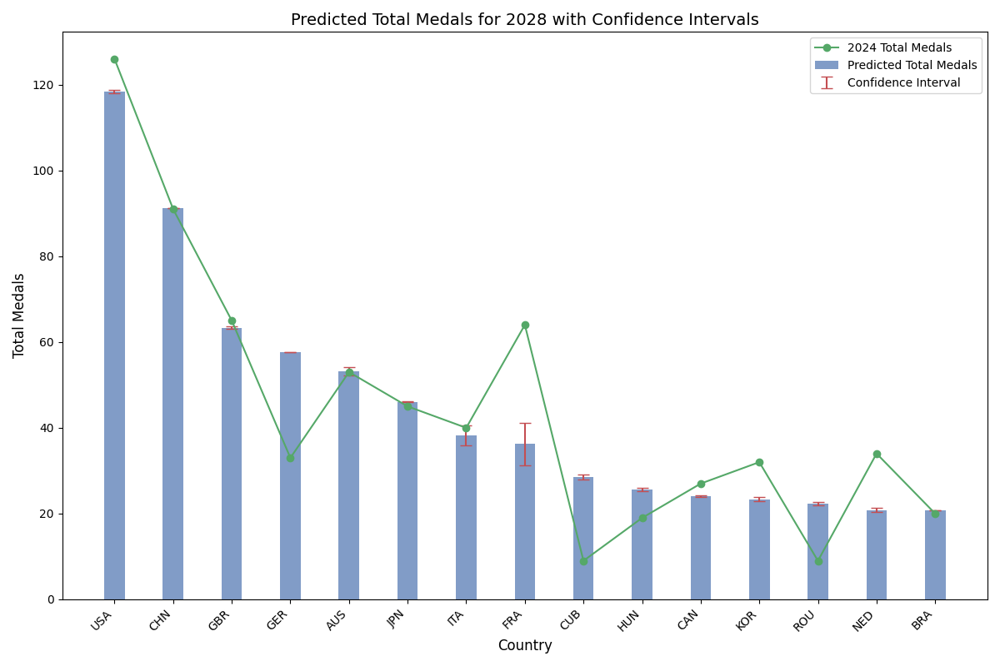
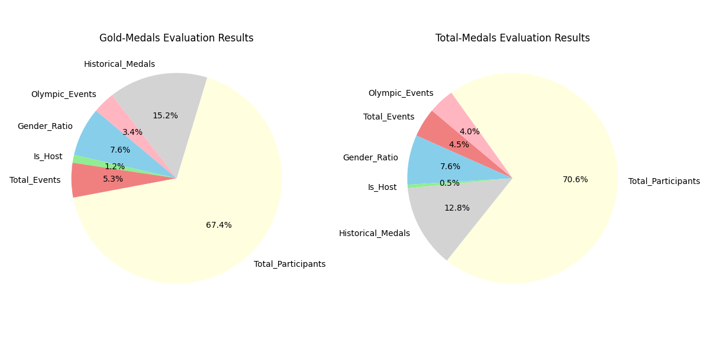
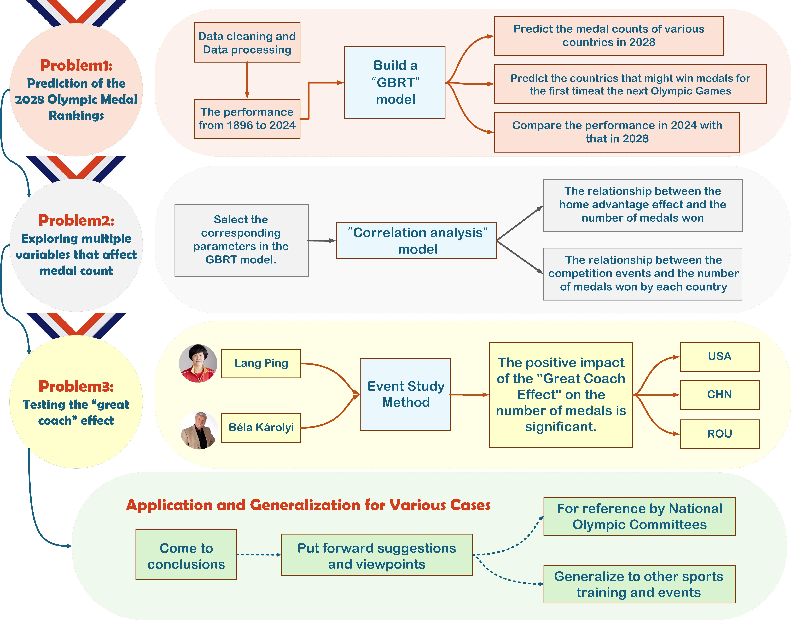
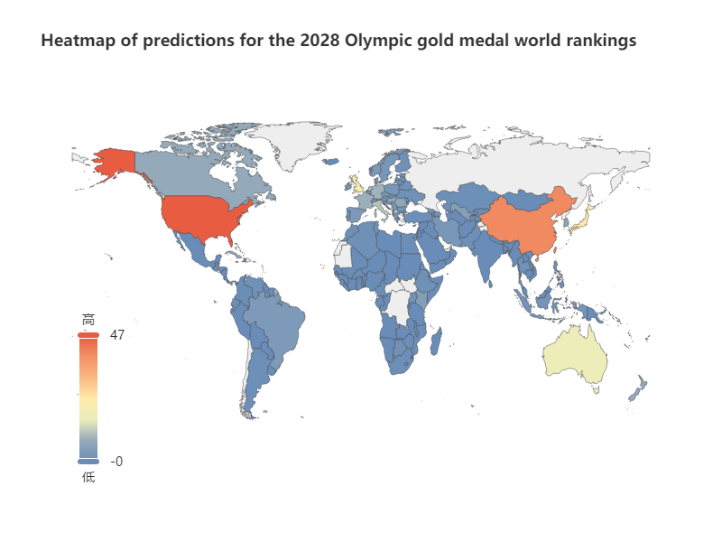
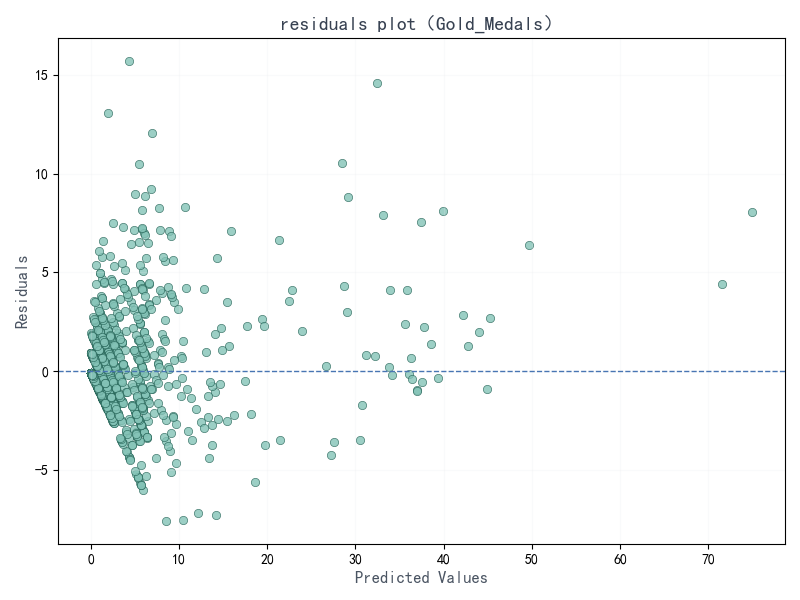
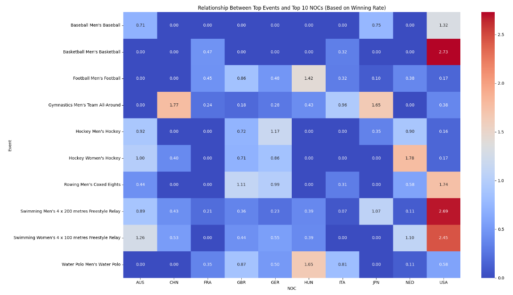

# 🏅 奥运会奖牌预测：2028 洛杉矶奥运会

[](README.md)
[](README_zh-CN.md)


一个基于 **梯度提升回归树 (GBRT)** 的综合机器学习系统，用于分析历史奥运数据并预测 **2028 年洛杉矶夏季奥运会** 的各国奖牌数量。

> 基于研究论文：《基于 GBRT 模型的预测与分析》。

---

## 📊 关键可视化

> 💡 *注意：这些图表是通过运行 `src/visualization/` 中的可视化脚本生成的。*

### 2028 奖牌总数预测
*预测表现最好的国家的奖牌总数，包含置信区间。*


### 特征重要性分析
*分析对金牌总数与奖牌总数贡献最大的因素。*


## 📑 研究洞察

源自我们 [研究论文](docs/Prediction_and_Analysis_Based_on_the_GBRT_Model.pdf) 中的核心 GBRT 分析。

### 1. GBRT 模型框架
*奥运奖牌预测的多特征回归系统方法。*


### 2. 历史表现与趋势分析
*可视化不同国家/地区的历史奖牌分布和演变模式。*


### 3. 特征相关性矩阵
*理解参赛人数、主办国身份与奖牌结果之间的相互依赖关系。*


### 4. 影响因素分析
*深入探究特定项目的贡献和表现驱动因素。*


---

## 🚀 主要特性

*   **高级数据清洗**：处理多源数据（运动员、奖牌、主办国、项目）的稳健管道。
*   **特征工程**：提取关键信号，包括主办国效应和历史动量。
*   **GBRT 建模**：使用网格搜索进行超参数优化的梯度提升回归器。

---

## 📂 项目结构

```bash
Predicting-Medals/
├── data/
│   ├── raw/                 # 原始数据集 (来自 Kaggle/Olympic.org)
│   └── processed/           # 清洗和合并后的 CSV 文件
├── docs/                    # 研究论文和文档
├── outputs/                 # 生成的图表和预测结果
├── result/                  # 来自研究论文的静态可视化资源
├── src/
│   ├── analysis/            # 统计分析脚本 (教练效应等)
│   ├── data_cleaning/       # 预处理管道
│   ├── feature_engineering/ # 特征构建
│   ├── models/              # GBRT 和线性回归模型
│   └── visualization/       # 绘图脚本
├── requirements.txt         # 项目依赖
├── .gitignore               # Git 忽略规则
├── LICENSE                  # MIT 许可证
└── README.md
```

---

## 🛠️ 安装

1.  **克隆仓库**
    ```bash
    git clone https://github.com/1EchA/Predicting-medals.git
    cd Predicting-medals
    ```

2.  **安装依赖**
    ```bash
    pip install -r requirements.txt
    ```

3.  **准备数据**
    将原始数据解压到 `data/raw` 目录：
    ```bash
    unzip data/Data.zip -d data/raw/
    ```

---

## 💻 使用方法

要复现分析和预测结果，请遵循以下流程：

### 1. 数据清洗
标准化名称，处理缺失值，并合并数据集。
```bash
python src/data_cleaning/clean_athletes.py
python src/data_cleaning/clean_medals.py
python src/data_cleaning/clean_hosts.py
python src/data_cleaning/clean_programs.py
```

### 2. 特征工程
构建包含历史特征的训练数据集。
```bash
python src/feature_engineering/build_dataset.py
python src/feature_engineering/merge_events.py
```

### 3. 模型训练与预测
训练 GBRT 模型并生成 2028 年的预测结果。
```bash
python src/models/gbrt_model.py
```

### 4. 可视化
生成上述展示的图表。
```bash
python src/visualization/gbrt_visualization.py
python src/visualization/feature_visualization.py
```

---

## 📈 模型性能

GBRT 模型使用 5 折交叉验证进行了网格搜索调优。

| 指标 | 值 |
| :--- | :--- |
| **模型** | Gradient Boosting Regressor |
| **CV MSE** | ~经过优化 |
| **关键超参数** | `n_estimators`: [100, 200], `learning_rate`: [0.05, 0.1] |

**关键发现：**
*   **主办国效应**：主办国的奖牌数量有显著提升。
*   **历史动量**：前几届比赛的表现是最强的预测因子。
*   **性别均等**：在现代奥运会中，均衡的性别比例与更高的总体奖牌数相关。

---

## 👥 作者

*   **1EchA** - *首席开发者 & 研究员*

## 📄 许可证

本项目基于 MIT 许可证开源 - 详情请查看 [LICENSE](LICENSE) 文件。
